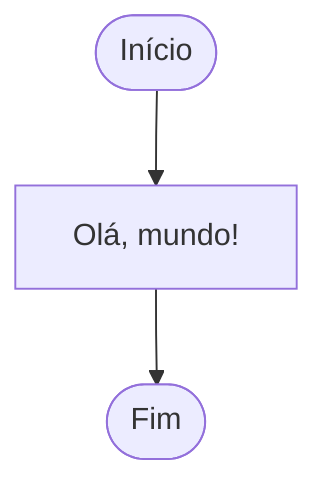

# Aula 04: Fluxogramas — Início e Fim

Bem-vindo à quarta aula do nosso curso de lógica de programação! Hoje vamos aprender sobre fluxogramas, focando nos símbolos de **início** e **fim**. Eles são essenciais para organizar e visualizar o funcionamento de qualquer programa.

## O que é um Fluxograma?

Um fluxograma é um desenho que mostra, passo a passo, como um programa funciona. Ele usa símbolos para representar ações, decisões e o caminho que o programa segue. É como um mapa para não se perder na hora de programar!

## Símbolos de Início e Fim

Todo fluxograma começa com o símbolo de **início** e termina com o símbolo de **fim**. Eles são como a porta de entrada e saída do seu programa.

- **Início**: Onde tudo começa.
- **Fim**: Onde tudo termina.

Esses símbolos ajudam a deixar claro quando o programa começa a rodar e quando ele termina.

## Exemplo de Fluxograma Simples

Vamos ver um fluxograma básico usando Mermaid para mostrar o início e o fim de um programa:

## Por que usar Início e Fim?

- Facilita o entendimento do programa.
- Ajuda a organizar as ideias antes de começar a programar.
- Evita confusão na hora de criar programas mais complexos.

## Praticando

Tente criar um fluxograma para uma tarefa simples, como escovar os dentes. Pense nos passos e use os símbolos de início e fim!

## O que entendi?

> Escreva aqui, com suas próprias palavras, o que você aprendeu sobre fluxogramas, início e fim. Como você acha que isso pode te ajudar a programar melhor?
