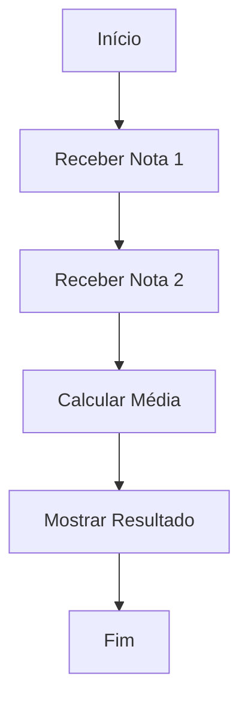

# Aula 04: Fluxogramas - Ações e Processos

Bem-vindo à quarta aula do nosso curso de lógica de programação! Hoje vamos mergulhar nos fluxogramas, focando nas **ações** e **processos**. Se você já viu os símbolos básicos, agora é hora de entender como eles ajudam a organizar ideias e criar programas mais eficientes.

---

## O que são Ações e Processos?

No mundo da programação, **ações** são tarefas que o computador executa, como calcular, mostrar uma mensagem ou salvar um dado. **Processos** são conjuntos de ações que acontecem em sequência para atingir um objetivo.

No fluxograma, usamos o símbolo de **retângulo** para representar ações/processos.

---

## Por que usar fluxogramas?

Fluxogramas ajudam a visualizar o passo a passo do programa antes mesmo de começar a codar. Eles facilitam:

- Entender o que precisa ser feito
- Identificar erros ou etapas faltando
- Explicar sua ideia para outras pessoas

---

## Exemplo de Fluxograma: Calculando a Média de Notas

Vamos criar um fluxograma simples para calcular a média de duas notas.

---

## Desafio: Crie seu próprio fluxograma

Pense em uma tarefa simples do dia a dia (como fazer um sanduíche ou organizar o material escolar) e desenhe um fluxograma com pelo menos 3 ações/processos. Use papel, um app ou o [Mermaid Live Editor](https://mermaid-js.github.io/mermaid-live-editor/).

---

## Se aprofundando: Diferença entre Ação e Decisão

Se quiser entender melhor como as **ações** se diferenciam das **decisões** (simbolizadas pelo losango), acesse a pasta `03-decisao` e confira o README.md lá!

---

## O que entendi?

> Escreva aqui, com suas próprias palavras, o que você aprendeu sobre ações e processos em fluxogramas. Dê exemplos, faça perguntas ou compartilhe dúvidas!
