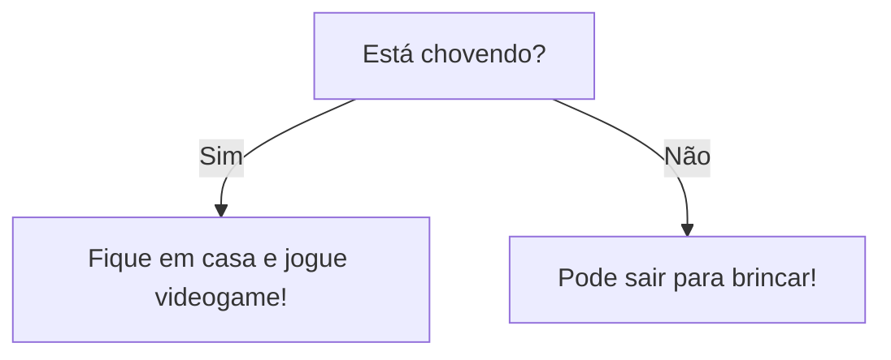

# Aula 04: Decisões

Bem-vindo à quarta aula do nosso curso de lógica de programação! Hoje vamos falar sobre **decisões**: como fazer o computador escolher caminhos diferentes dependendo das situações. Isso é essencial para criar programas inteligentes e interativos.

## O que são decisões?

Decisões são instruções que dizem ao computador: "Se acontecer isso, faça aquilo. Se não, faça outra coisa." É como escolher entre ir ao cinema ou jogar videogame dependendo do tempo.

## Estruturas de decisão

A principal estrutura de decisão é o famoso `if` (em português, "se"). Veja como funciona:

```javascript
if (condição) {
    // código executado se a condição for verdadeira
} else {
    // código executado se a condição for falsa
}
```

## Exemplo prático

Imagine que você quer saber se pode sair para brincar:

```javascript
let estaChovendo = true;

if (estaChovendo) {
    console.log("Fique em casa e jogue videogame!");
} else {
    console.log("Pode sair para brincar!");
}
```

## Fluxograma de decisão

Vamos visualizar isso com um fluxograma usando Mermaid:



## Decisões múltiplas

Às vezes, precisamos de mais opções. Para isso, usamos `else if`:

```javascript
let nota = 7;

if (nota >= 9) {
    console.log("Parabéns! Você tirou nota máxima!");
} else if (nota >= 6) {
    console.log("Você passou!");
} else {
    console.log("Estude mais para a próxima.");
}
```

## Exercício

Crie um fluxograma para decidir o que fazer dependendo da hora do dia: manhã, tarde ou noite.

## O que entendi?

> Escreva aqui, com suas próprias palavras, o que você entendeu sobre decisões em programação. Como você usaria isso para resolver problemas do dia a dia?
