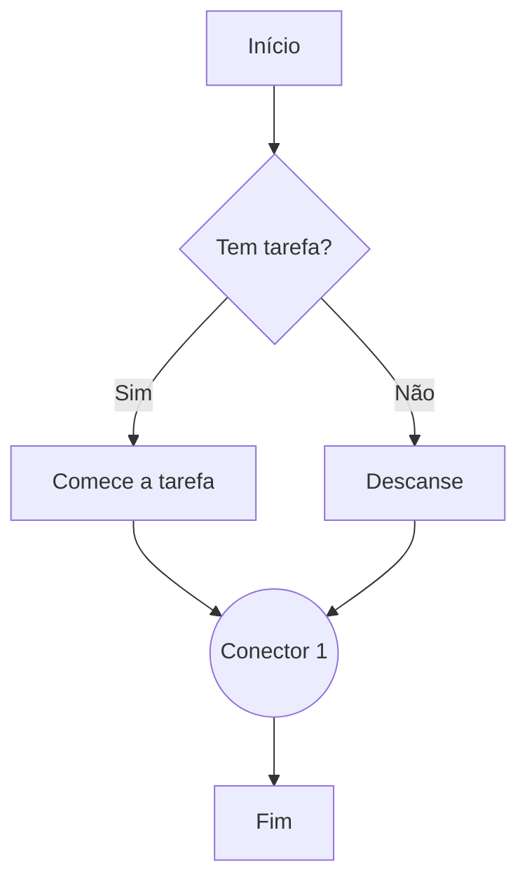

# Aula 04: Conectores e Fluxo

Bem-vindo à quarta aula do nosso curso de lógica de programação! Hoje vamos explorar como os conectores ajudam a organizar e direcionar o fluxo dos nossos algoritmos, especialmente em fluxogramas. Se você já achou os fluxogramas legais, prepare-se para deixá-los ainda mais profissionais e claros!

> **Conectores** são círculos usados para ligar partes diferentes do fluxograma.  
> **Setas** mostram o caminho que o fluxo segue entre as etapas.

---

## O que são conectores?

Conectores são símbolos usados em fluxogramas para indicar que o fluxo continua em outro ponto do diagrama. Eles são super úteis quando o desenho fica muito grande ou quando precisamos "pular" de uma parte para outra sem bagunçar tudo.

### Por que usar conectores?

- **Organização:** Evitam linhas cruzando o fluxograma inteiro.
- **Clareza:** Facilitam a leitura e o entendimento do fluxo.
- **Modularidade:** Permitem dividir o fluxograma em partes menores.

---

## Tipos de conectores

Existem dois tipos principais:

- **Conector interno:** Usado dentro do mesmo fluxograma para ligar pontos distantes.
- **Conector externo:** Indica que o fluxo continua em outro diagrama ou página.

---

## Como usar conectores em fluxogramas

Vamos ver um exemplo prático usando o Mermaid para desenhar um fluxograma com conectores:

No exemplo acima, o "Conector 1" mostra que tanto quem começa a tarefa quanto quem descansa vai para o mesmo ponto do fluxo antes de terminar.

---

## Dicas para usar conectores

- Dê nomes ou números aos conectores para não se perder.
- Use conectores só quando necessário, para não complicar demais.
- Sempre explique o que cada conector faz.

---

## Exercício rápido

Desenhe um fluxograma simples de "Estudo para prova" usando pelo menos um conector. Use o Mermaid ou papel e caneta!

---

## O que entendi?

> Escreva aqui, com suas palavras, o que você entendeu sobre conectores e fluxo em fluxogramas. Como você acha que pode usar isso para organizar melhor suas ideias e tarefas?

| [⬅️ Parte Anterior](../03-decisoes/README.md) | Navegação | [Próxima Parte ➡️](../05-lacos-de-repeticao/README.md) |
