# Aula 04: Exemplos de Fluxogramas

Bem-vindo à aula de exemplos de fluxogramas! Aqui você vai ver como fluxogramas podem ajudar a organizar ideias, resolver problemas e até criar programas. Vamos explorar 15 exemplos, cada um com explicação e fluxograma desenhado com Mermaid. Pronto para mergulhar?

---

## 1. Fluxograma para Fazer um Sanduíche

Antes de programar, que tal organizar o passo a passo de um lanche?

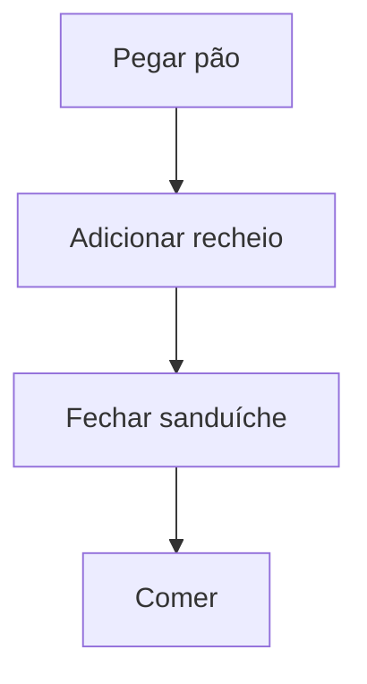

**Explicação:** Você começa pegando o pão, coloca o recheio, fecha e come. Simples, né?

---

## 2. Fluxograma para Decidir se Vai Chover

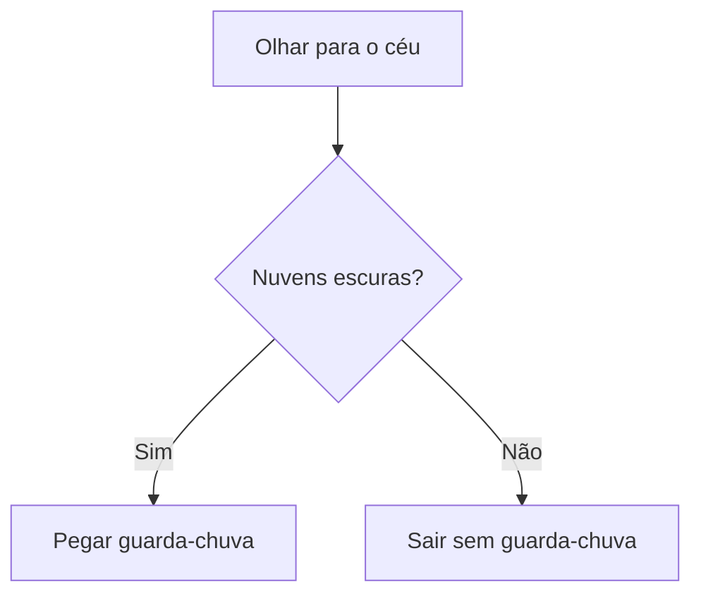

**Explicação:** Olhe para o céu. Se tiver nuvens escuras, leve guarda-chuva!

---

## 3. Fluxograma para Estudar para Prova

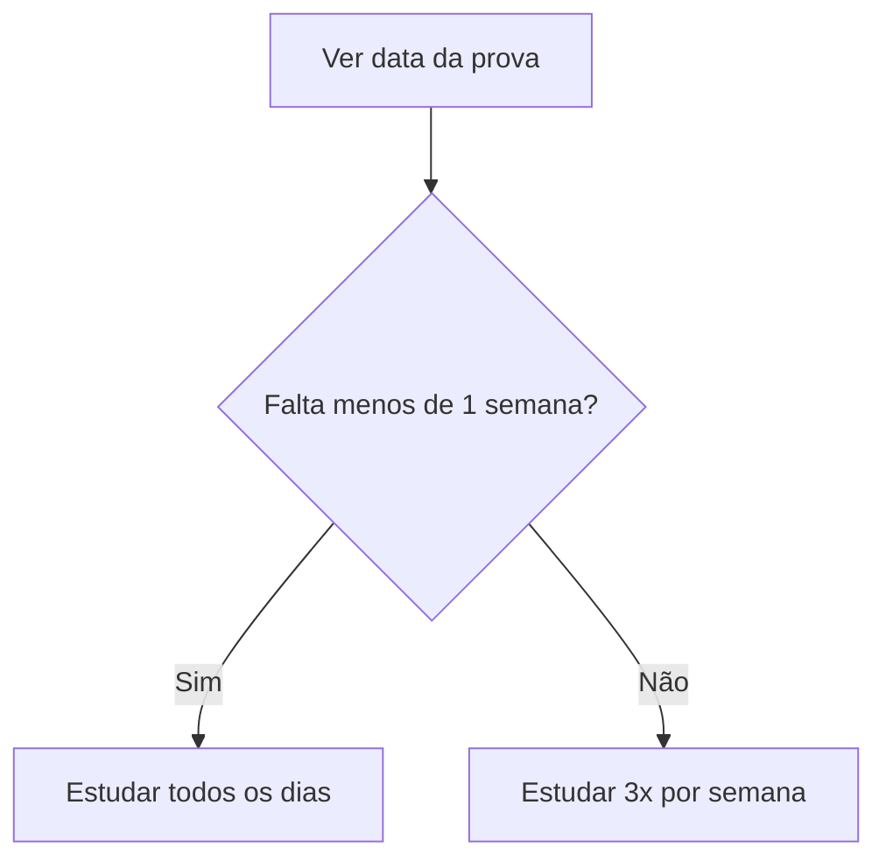

**Explicação:** Quanto menos tempo, mais estudo!

---

## 4. Fluxograma para Ligar para um Amigo

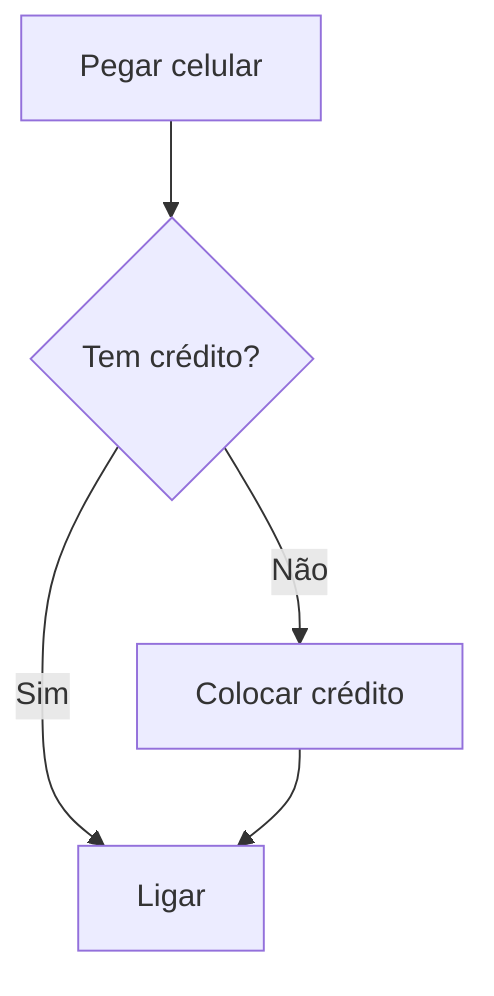

**Explicação:** Sem crédito, sem ligação!

---

## 5. Fluxograma para Escolher o Que Assistir

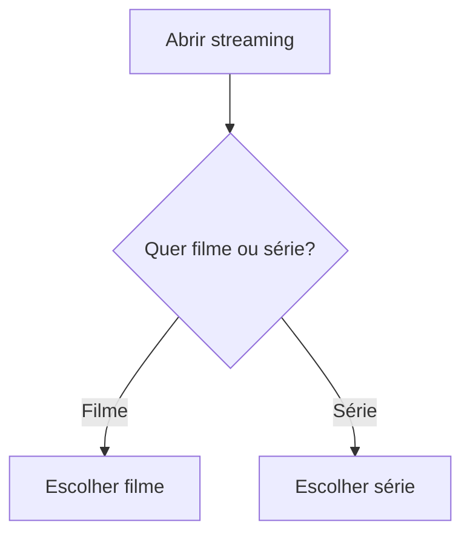

**Explicação:** Decida entre filme ou série e escolha!

---

## 6. Fluxograma para Fazer um Café

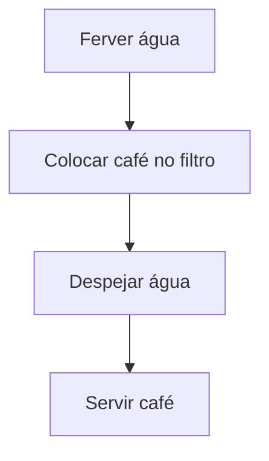

**Explicação:** Água quente, café no filtro, despeja e serve!

---

## 7. Fluxograma para Resolver uma Conta de Matemática

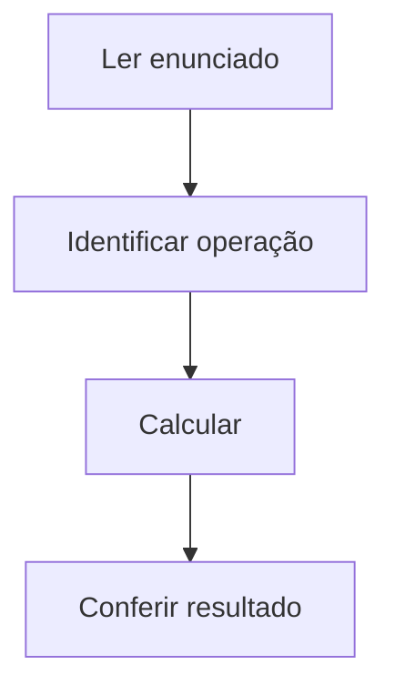

**Explicação:** Leia, identifique, calcule e confira.

---

## 8. Fluxograma para Ir à Escola

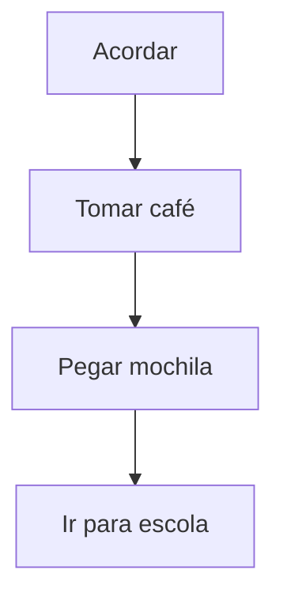

**Explicação:** Acorda, café, mochila e escola!

---

## 9. Fluxograma para Jogar Videogame

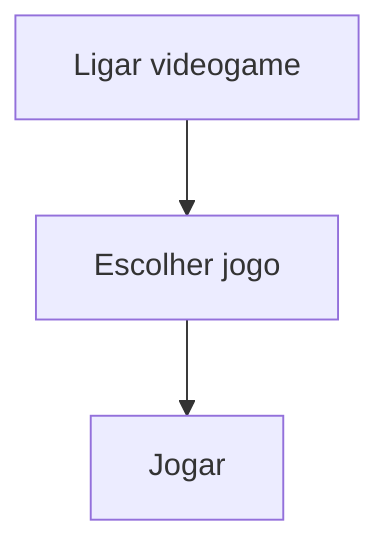

**Explicação:** Ligue, escolha e jogue!

---

## 10. Fluxograma para Fazer Tarefa de Casa

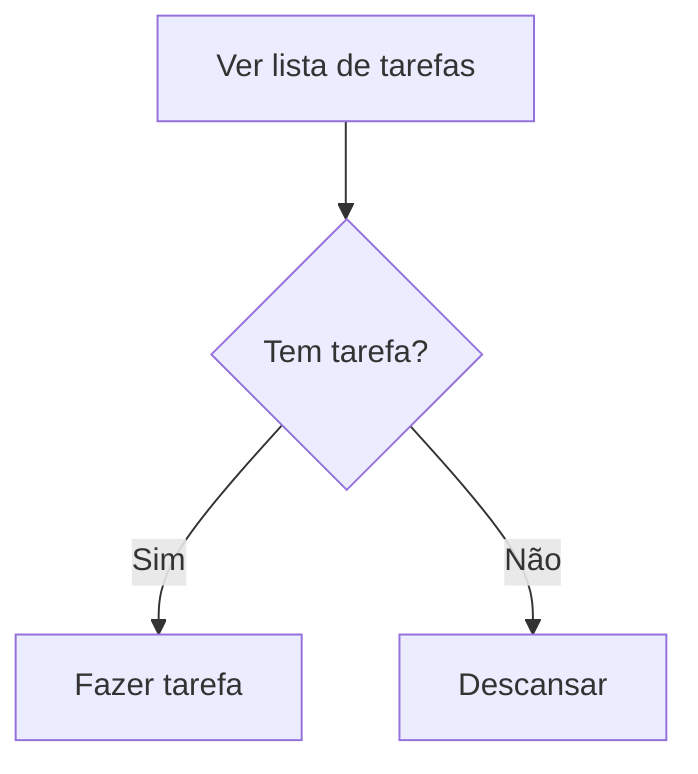

**Explicação:** Se tem tarefa, faça. Se não, relaxe!

---

## 11. Fluxograma para Comprar um Produto Online

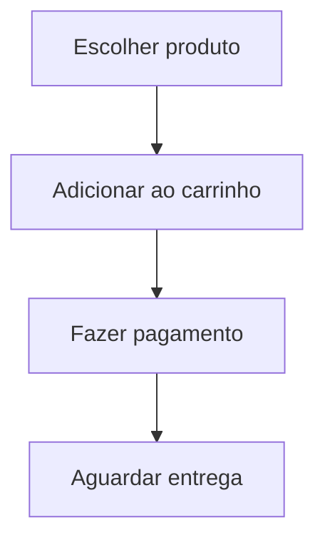

**Explicação:** Escolha, pague e espere chegar.

---

## 12. Fluxograma para Trocar de Roupa

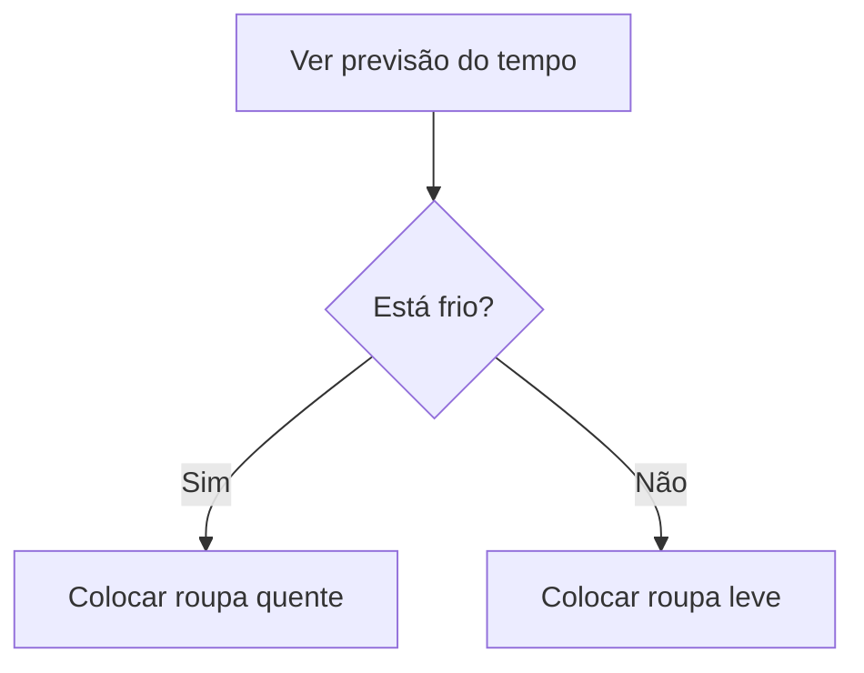

**Explicação:** O clima decide sua roupa!

---

## 13. Fluxograma para Fazer um Desenho

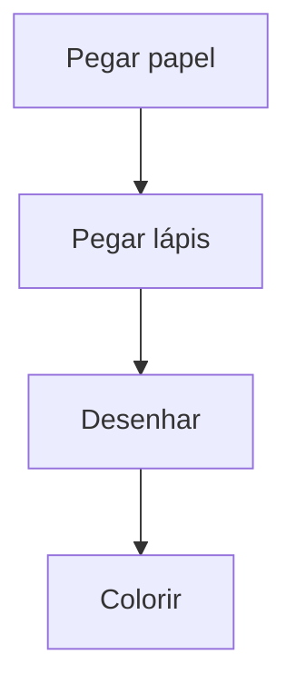

**Explicação:** Papel, lápis, desenhe e pinte!

---

## 14. Fluxograma para Cuidar de um Pet

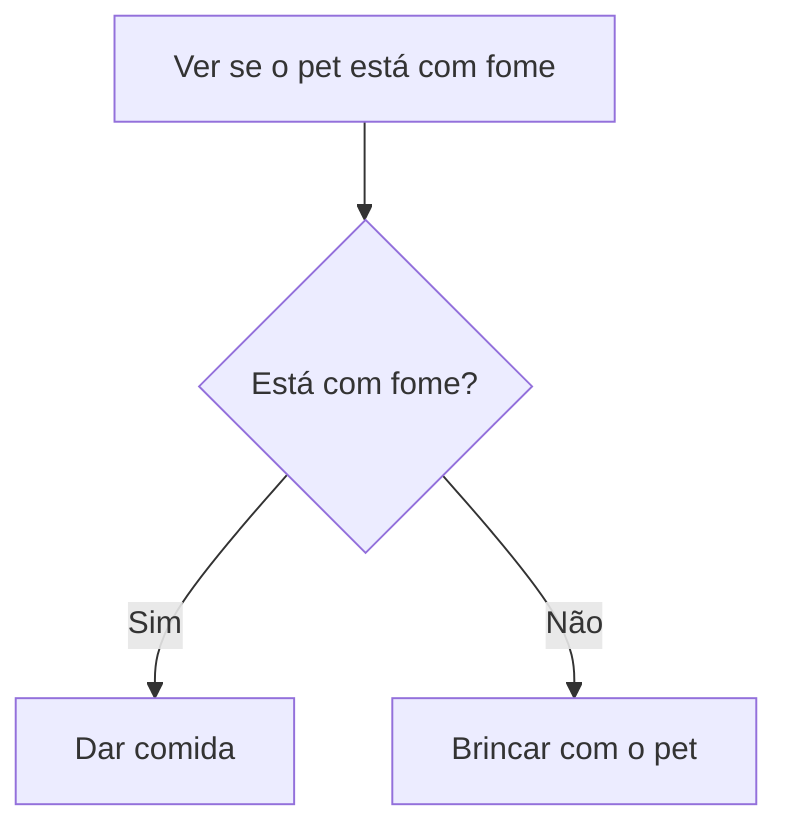

**Explicação:** Se está com fome, alimente. Se não, brinque!

---

## 15. Fluxograma para Organizar o Quarto

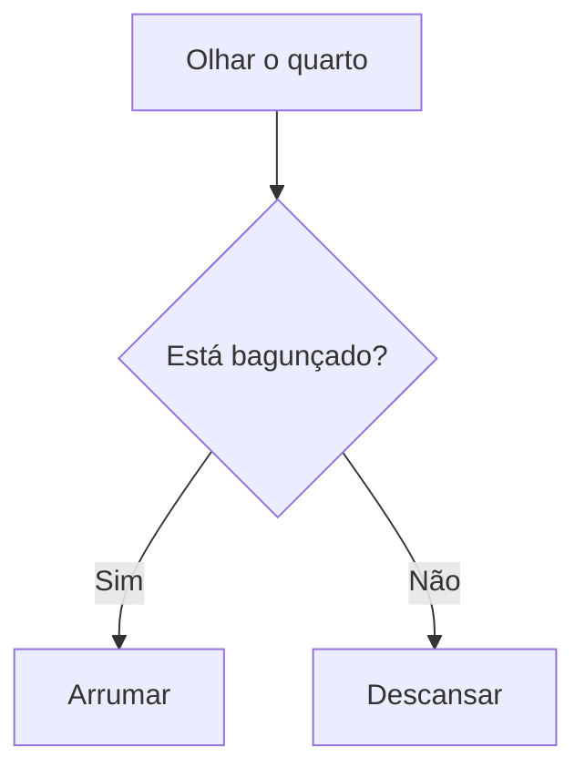

**Explicação:** Se está bagunçado, arrume. Se não, aproveite!

---

## O que entendi?

> Escreva aqui, com suas palavras, o que você aprendeu sobre fluxogramas e como eles podem ajudar no seu dia a dia. Dê exemplos próprios e compartilhe suas ideias!
