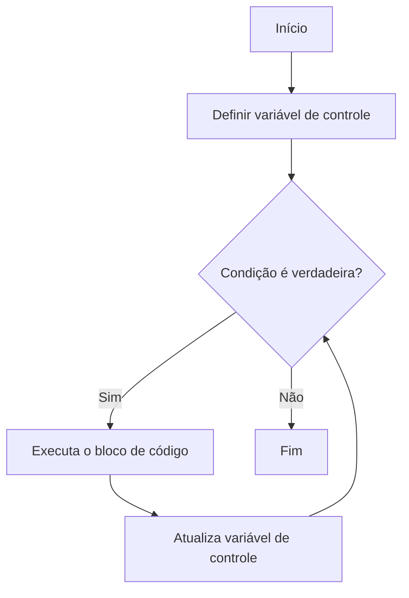

# Aula 04: Laços de Repetição

## Introdução

Sabe quando você precisa repetir uma tarefa várias vezes, tipo jogar videogame até passar de fase ou assistir a mesma série de novo? Na programação, isso também acontece! Os **laços de repetição** servem para automatizar essas repetições, economizando tempo e evitando erros.

## Por que usar laços de repetição?

Imagine que você precisa imprimir os números de 1 a 100 na tela. Fazer isso manualmente seria chato e demorado. Com um laço de repetição, você escreve poucas linhas e o computador faz o trabalho pesado pra você!

## Tipos de laços

Os principais laços que você vai encontrar são:

- **while**: repete enquanto uma condição for verdadeira.
- **for**: repete um número determinado de vezes.
- **do...while**: repete pelo menos uma vez, depois verifica a condição.

### Exemplo prático

```javascript
// Imprime os números de 1 a 5
for (let i = 1; i <= 5; i++) {
    console.log(i);
}
```

## Fluxograma de um laço de repetição

Veja como funciona o fluxo de um laço usando mermaid:



## Dicas para não se perder

- Sempre pense: "Quando meu laço deve parar?"
- Cuidado com laços infinitos! Eles podem travar seu programa.
- Teste com exemplos simples antes de partir para algo mais complexo.

## Se aprofundando

Se quiser entender melhor cada tipo de laço, confira os links abaixo:

- [while](./while/README.md)
- [do...while](./do-while/README.md)
- [for](./for/README.md)

## O que entendi?

> Escreva aqui, com suas palavras, o que você aprendeu sobre laços de repetição. Como você acha que pode usar isso no seu dia a dia ou em projetos de programação?
