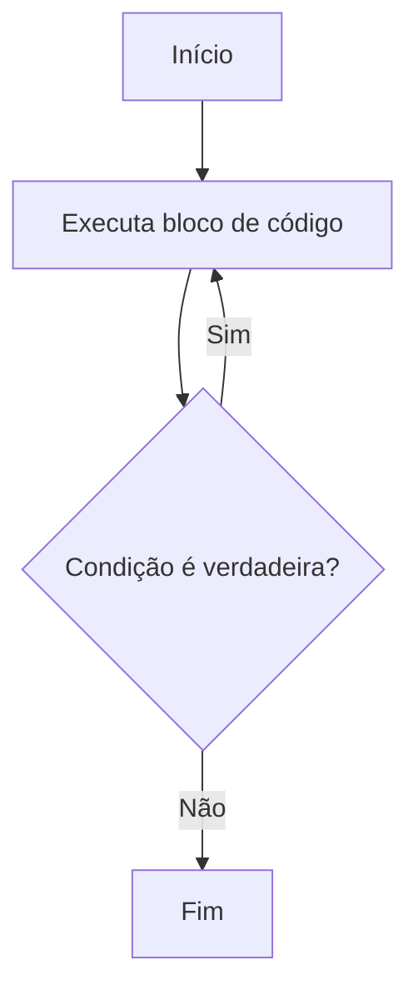

# Aula 04: Laços de Repetição - Do While

## Introdução

Chegou a hora de aprender sobre um dos laços de repetição mais usados na programação: o **do while**! Se você já ficou preso em um loop de vídeos no TikTok, vai entender rapidinho como funciona: a ideia é repetir uma ação até que uma condição seja satisfeita.

## O que é o Do While?

O laço **do while** executa um bloco de código **pelo menos uma vez**, e depois verifica se deve continuar repetindo. Ele é diferente do `while` tradicional, porque a condição é checada **depois** da execução do bloco.

### Sintaxe

```javascript
do {
    // código a ser repetido
} while (condição);
```

## Exemplo Prático

Imagine que você está jogando um game e quer perguntar ao jogador se ele quer continuar jogando. Com o `do while`, você garante que a pergunta será feita pelo menos uma vez:

```javascript
let jogarNovamente;
do {
    jogarNovamente = prompt("Quer jogar novamente? (s/n)");
} while (jogarNovamente === "s");
```

## Fluxograma do Do While

Veja como o fluxo funciona usando mermaid:



## Quando Usar Do While?

- Quando você precisa garantir que o bloco de código seja executado pelo menos uma vez.
- Quando a condição depende de algo que só pode ser verificado **depois** da primeira execução.

## Diferença entre While e Do While

| While | Do While |
|-------|----------|
| Verifica a condição antes de executar o bloco | Executa o bloco antes de verificar a condição |
| Pode não executar nenhuma vez | Executa pelo menos uma vez |

## Exercício

Crie um programa que peça ao usuário para digitar uma senha até que ele acerte. Use o laço `do while`!

## O que entendi?

> Escreva aqui, com suas próprias palavras, o que você entendeu sobre o laço de repetição do while. Dê exemplos, faça perguntas, ou relate dúvidas!