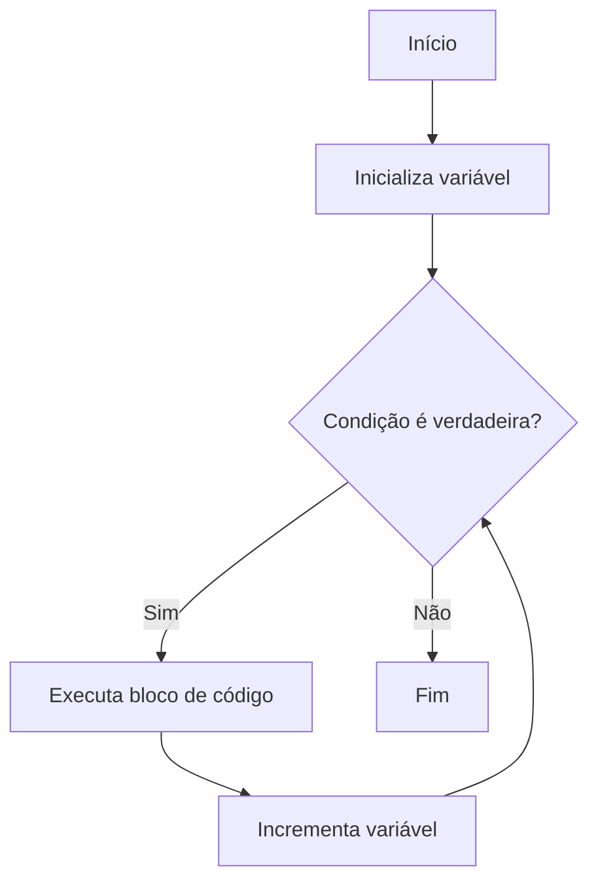

# Aula 04: Laços de Repetição - `for`

## Introdução

Sabe quando você precisa repetir uma tarefa várias vezes, tipo jogar várias partidas de um game ou assistir vários episódios de uma série? Na programação, isso é feito com os **laços de repetição**! Hoje vamos aprender sobre o laço `for`, que é super útil para repetir comandos um número determinado de vezes.

---

## O que é um laço `for`?

O laço `for` é uma estrutura que permite executar um bloco de código várias vezes, controlando quantas vezes isso acontece. Ele é perfeito quando você já sabe quantas repetições precisa fazer.

### Sintaxe básica

```javascript
for (let i = 0; i < 5; i++) {
    console.log("Repetição número " + i);
}
```

- **Inicialização**: `let i = 0` (começa do zero)
- **Condição**: `i < 5` (enquanto for menor que 5)
- **Incremento**: `i++` (aumenta 1 a cada volta)

---

## Fluxograma do laço `for`

Veja como funciona o fluxo de um laço `for`:



---

## Exemplos práticos

### Contando de 1 a 10

```javascript
for (let i = 1; i <= 10; i++) {
    console.log(i);
}
```

### Somando números de 1 a 5

```javascript
let soma = 0;
for (let i = 1; i <= 5; i++) {
    soma += i;
}
console.log("A soma é: " + soma);
```

---

## Quando usar o `for`?

- Quando você sabe quantas vezes quer repetir algo.
- Para percorrer listas, arrays ou sequências.
- Para criar animações, jogos, ou qualquer coisa que precise de repetição controlada.

---

## Explorando mais

Se quiser se aprofundar, confira a pasta [`for/explicacao`](./explicacao/README.md) para entender como o laço `for` funciona por dentro e ver mais exemplos legais!

---

## O que entendi?

> Escreva aqui, com suas próprias palavras, o que você entendeu sobre o laço `for`. Como você acha que pode usar isso no seu dia a dia de programação? Dê exemplos que façam sentido para você!
