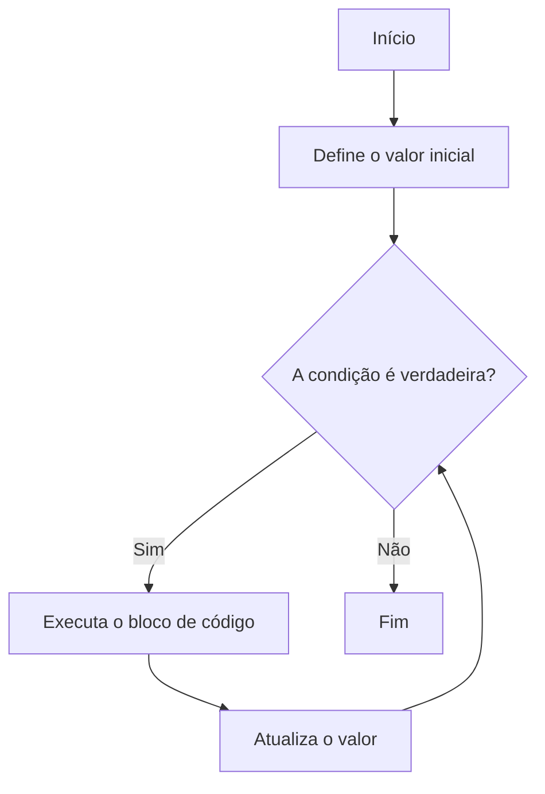

# Aula 04: Laços de Repetição - For

## Introdução

Você já pensou em como seria cansativo repetir várias vezes o mesmo comando no computador? Imagine pedir para ele contar de 1 até 10, um número por vez! Para facilitar nossa vida (e a do computador), existem os **laços de repetição**. Hoje vamos aprender sobre o laço `for`, que é como um superpoder para repetir tarefas de forma rápida e organizada.

## O que é o laço `for`?

O laço `for` é uma estrutura que permite executar um bloco de código várias vezes, controlando exatamente quantas vezes isso vai acontecer. Ele é muito usado quando sabemos o número de repetições que queremos fazer.

### Sintaxe básica

```python
for i in range(1, 6):
    print(i)
```

Nesse exemplo, o computador vai imprimir os números de 1 a 5. O `i` é uma variável que muda a cada repetição.

## Como funciona o laço `for`?

Vamos visualizar o fluxo de funcionamento usando Mermaid:



## Exemplos práticos

### Contando de 1 a 10

```python
for numero in range(1, 11):
    print(numero)
```

### Somando números de uma lista

```python
lista = [2, 4, 6, 8]
soma = 0
for numero in lista:
    soma += numero
print(soma)
```

## Quando usar o `for`?

- Quando você sabe quantas vezes quer repetir algo.
- Para percorrer listas, textos ou qualquer sequência de dados.
- Para automatizar tarefas repetitivas.

## Desafios para praticar

1. Faça um programa que imprima todos os números pares de 1 a 20.
2. Some todos os números ímpares de 1 a 100 usando um laço `for`.

## O que entendi?

> Escreva aqui, com suas próprias palavras, o que você entendeu sobre o laço `for`. Dê exemplos, explique como funciona e onde você acha que pode usar no seu dia a dia!
