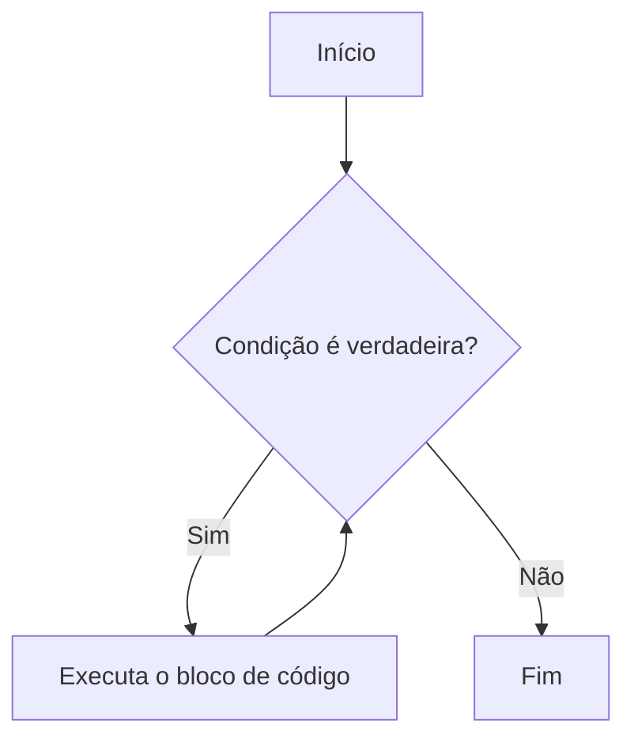

# Aula 04: Laços de Repetição - While

## Introdução

Você já pensou em como um videogame repete várias vezes uma ação até que você vença ou perca? Ou como um aplicativo fica esperando você clicar em um botão? Tudo isso acontece graças aos **laços de repetição**! Nesta aula, vamos mergulhar no laço `while`, que é uma das formas mais usadas para repetir tarefas na programação.

---

## O que é um laço de repetição?

Um laço de repetição é uma estrutura que permite executar um bloco de código várias vezes, enquanto uma condição for verdadeira. É como um ciclo: enquanto a condição não mudar, o código continua rodando.

---

## Laço While

O laço `while` funciona assim: ele verifica uma condição. Se for verdadeira, executa o bloco de código. Depois, volta e verifica a condição de novo. Se ainda for verdadeira, repete tudo. E assim vai, até que a condição seja falsa.

### Sintaxe

```python
while condição:
    # código que será repetido
```

### Exemplo

```python
contador = 0
while contador < 5:
    print("Contador:", contador)
    contador += 1
```

---

## Fluxograma do While

Veja como o fluxo do laço `while` funciona:



---

## Dicas para não cair em ciladas

- **Cuidado com loops infinitos!** Se a condição nunca ficar falsa, o laço nunca termina.
- Sempre pense em como a condição vai mudar dentro do laço.
- Use variáveis para controlar o fluxo.

---

## Praticando

Tente criar um programa que peça para o usuário digitar números até que ele digite zero. Mostre todos os números digitados.

---

## O que entendi?

> Escreva aqui, com suas palavras, o que você entendeu sobre laços de repetição e o laço `while`. Dê exemplos do seu dia a dia onde você acha que algo parecido acontece!
