# Aula 06: Exemplos de Fluxogramas

Bem-vindo à aula de exemplos de fluxogramas! Aqui você vai ver como fluxogramas podem ajudar a organizar ideias, resolver problemas e até criar programas. Vamos explorar 15 exemplos, cada um com explicação e fluxograma desenhado com Mermaid. Pronto para mergulhar?

> Aqui você encontra exemplos completos de fluxogramas, integrando todos os símbolos e conceitos aprendidos até aqui.

---

## Como visualizar os fluxogramas no Mermaid Live Editor

Você pode copiar qualquer bloco de código Mermaid abaixo e colar no [Mermaid Live Editor](https://mermaid.live/) para visualizar, editar e exportar os fluxogramas.

---

## 1. Fluxograma para Fazer um Sanduíche

Antes de programar, que tal organizar o passo a passo de um lanche?

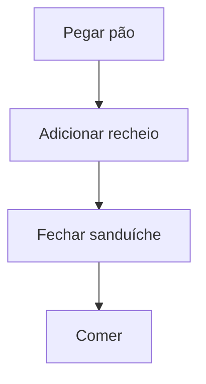

**Explicação:** Você começa pegando o pão, coloca o recheio, fecha e come. Simples, né?

---

## 2. Fluxograma para Decidir se Vai Chover

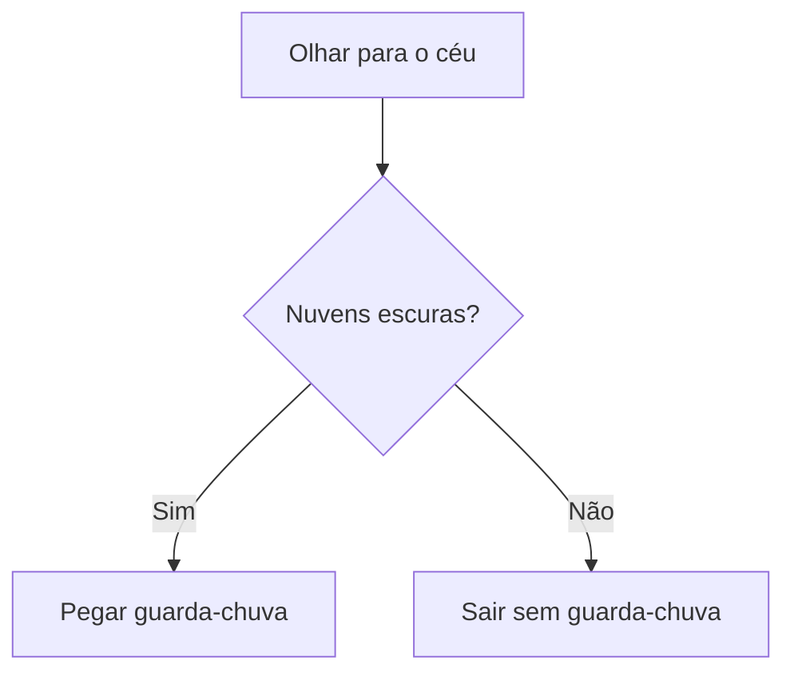

**Explicação:** Olhe para o céu. Se tiver nuvens escuras, leve guarda-chuva!

---

## 3. Fluxograma para Estudar para Prova

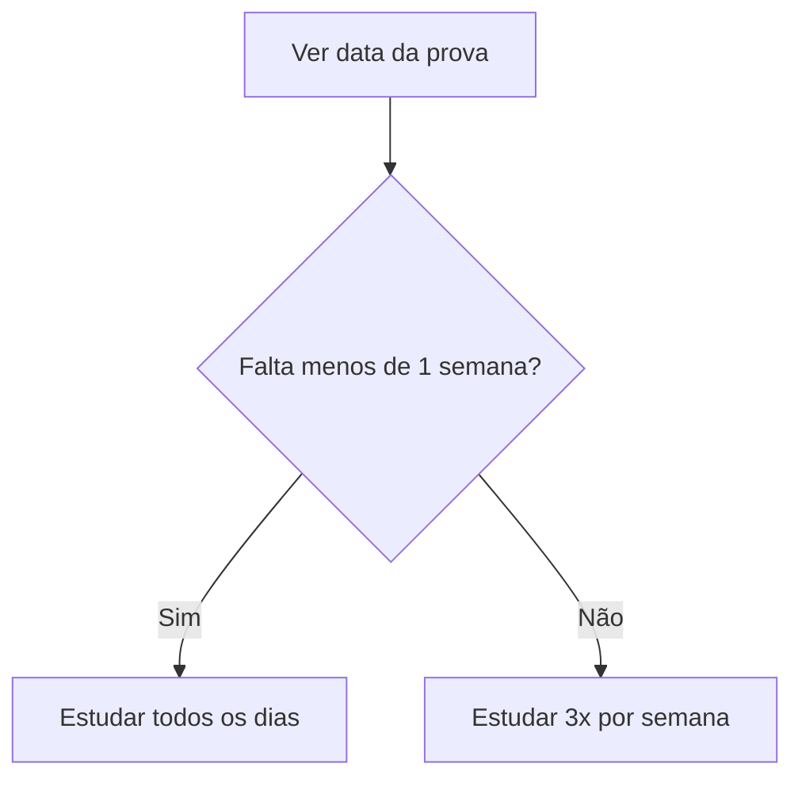

**Explicação:** Quanto menos tempo, mais estudo!

---

## 4. Fluxograma para Ligar para um Amigo

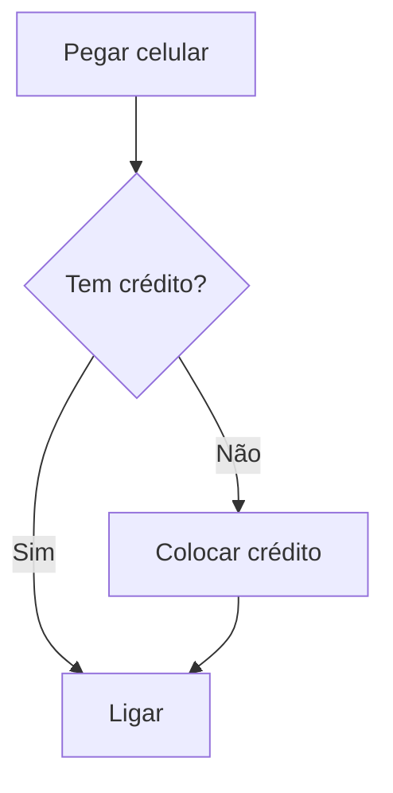

**Explicação:** Sem crédito, sem ligação!

---

## 5. Fluxograma para Escolher o Que Assistir

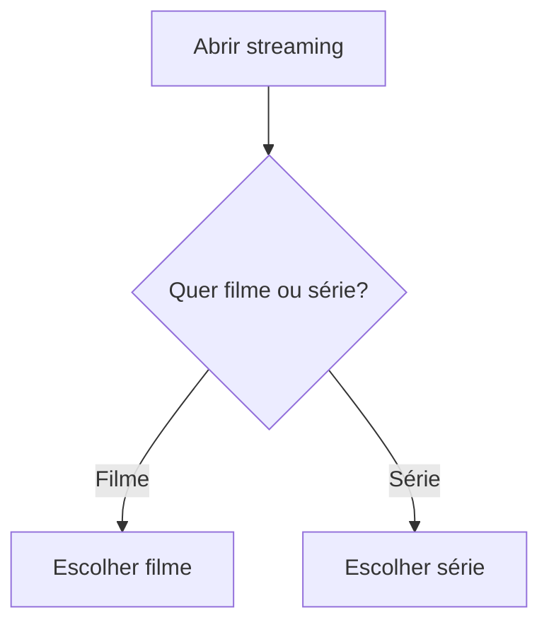

**Explicação:** Decida entre filme ou série e escolha!

---

## 6. Fluxograma para Fazer um Café

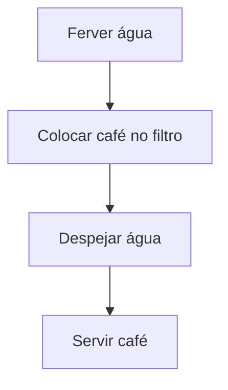

**Explicação:** Água quente, café no filtro, despeja e serve!

---

## 7. Fluxograma para Resolver uma Conta de Matemática

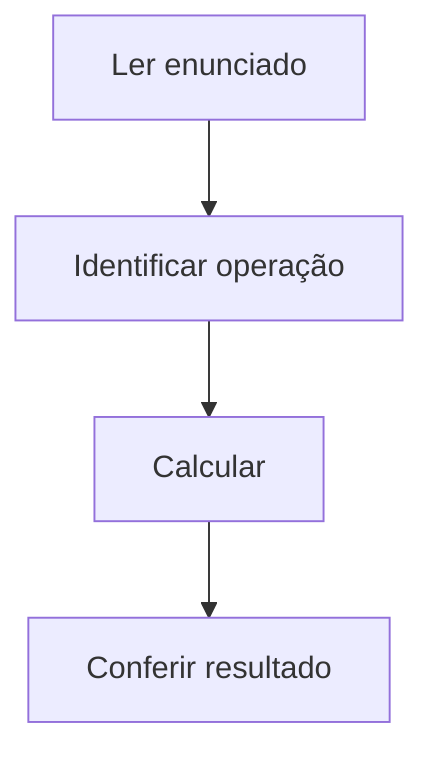

**Explicação:** Leia, identifique, calcule e confira.

---

## 8. Fluxograma para Ir à Escola

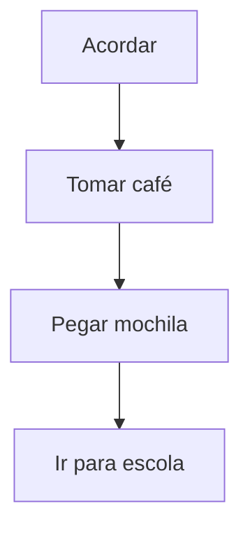

**Explicação:** Acorda, café, mochila e escola!

---

## 9. Fluxograma para Jogar Videogame

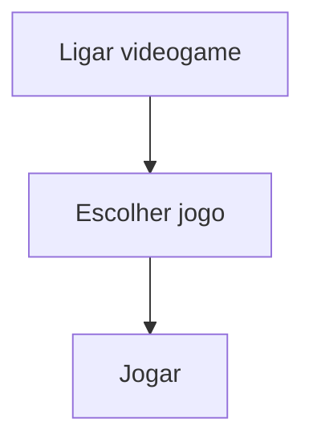

**Explicação:** Ligue, escolha e jogue!

---

## 10. Fluxograma para Fazer Tarefa de Casa

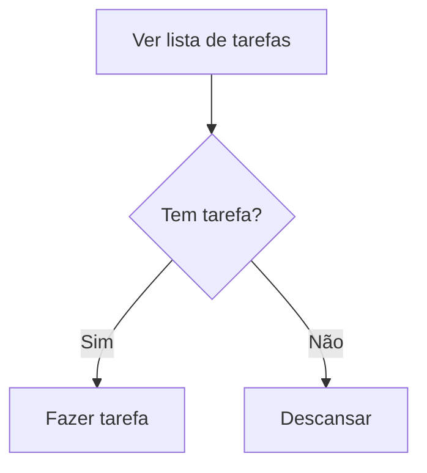

**Explicação:** Se tem tarefa, faça. Se não, relaxe!

---

## 11. Fluxograma para Comprar um Produto Online

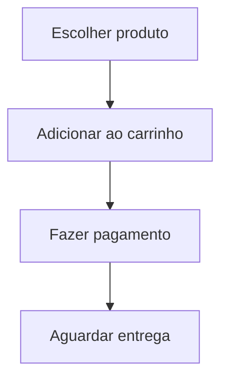

**Explicação:** Escolha, pague e espere chegar.

---

## 12. Fluxograma para Trocar de Roupa

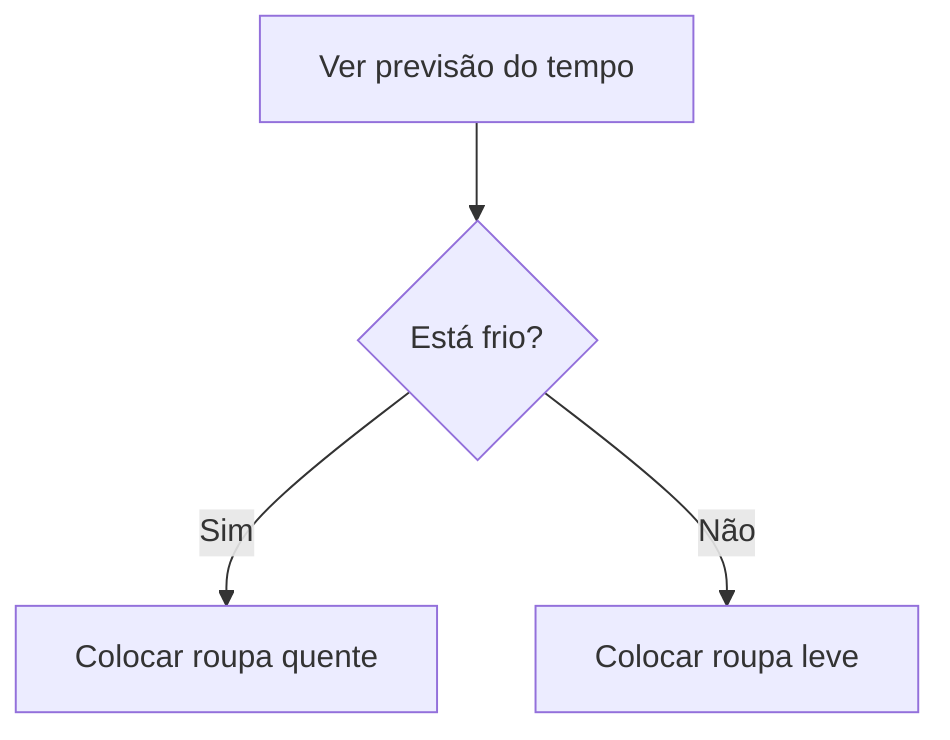

**Explicação:** O clima decide sua roupa!

---

## 13. Fluxograma para Fazer um Desenho

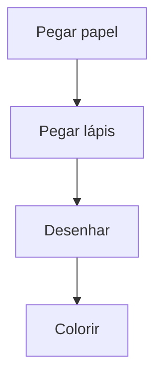

**Explicação:** Papel, lápis, desenhe e pinte!

---

## 14. Fluxograma para Cuidar de um Pet

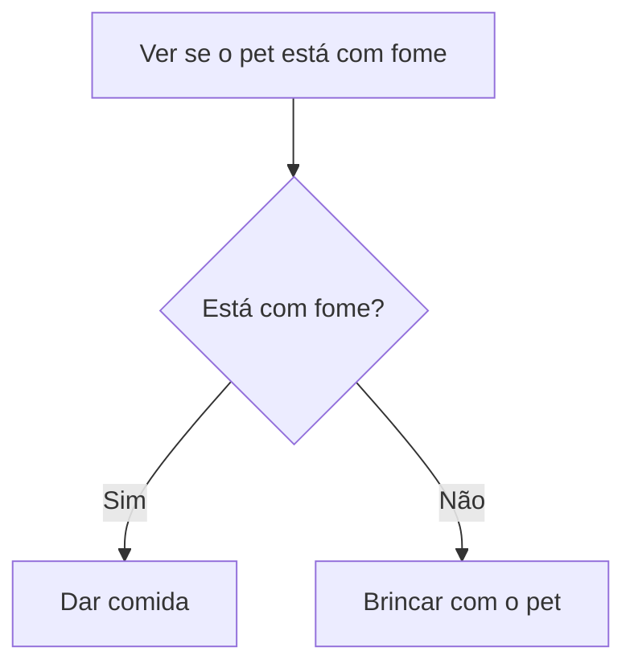

**Explicação:** Se está com fome, alimente. Se não, brinque!

---

## 15. Fluxograma para Organizar o Quarto

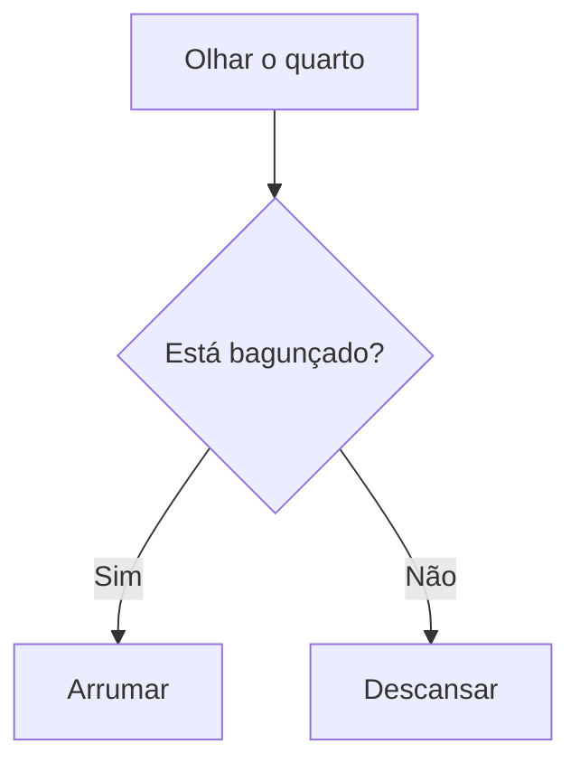

**Explicação:** Se está bagunçado, arrume. Se não, aproveite!

---

## Exemplos de Fluxogramas com Laços de Repetição

### Laço "Enquanto" (while)

1. **Contar de 1 a 5**

    ```mermaid
    flowchart TD
        iniciar_contador[Iniciar contador em 1] --> verificar_contador{contador <= 5?}
        verificar_contador -- Sim --> mostrar_contador[Mostrar contador]
        mostrar_contador --> incrementar_contador[Incrementar contador com +1]
        incrementar_contador --> verificar_contador
        verificar_contador -- Não --> fim_contagem[Fim]
    ```

2. **Verificar se há tarefas pendentes**

    ```mermaid
    flowchart TD
        ver_lista_tarefas_while[Ver lista de tarefas] --> verificar_tarefa_while{Tem tarefa?}
        verificar_tarefa_while -- Sim --> fazer_tarefa_while[Fazer tarefa]
        fazer_tarefa_while --> ver_lista_tarefas_while
        verificar_tarefa_while -- Não --> fim_tarefas[Fim]
    ```

3. **Esperar até a água ferver**

    ```mermaid
    flowchart TD
        ligar_fogao[Ligar fogão] --> verificar_agua_ferveu{Água ferveu?}
        verificar_agua_ferveu -- Não --> esperar_agua[Esperar]
        esperar_agua --> verificar_agua_ferveu
        verificar_agua_ferveu -- Sim --> desligar_fogao[Desligar fogão]
    ```

4. **Ler mensagens enquanto houver novas**

    ```mermaid
    flowchart TD
        abrir_app[Abrir aplicativo] --> verificar_mensagem_nova{Tem mensagem nova?}
        verificar_mensagem_nova -- Sim --> ler_mensagem[Ler mensagem]
        ler_mensagem --> verificar_mensagem_nova
        verificar_mensagem_nova -- Não --> fim_leitura[Fim]
    ```

5. **Repetir exercícios até cansar**

    ```mermaid
    flowchart TD
        iniciar_exercicio[Iniciar exercício] --> verificar_cansaco{Está cansado?}
        verificar_cansaco -- Não --> fazer_exercicio[Fazer exercício]
        fazer_exercicio --> verificar_cansaco
        verificar_cansaco -- Sim --> parar_exercicio[Parar]
    ```

---

### Laço "Para" (for)

1. **Enviar convite para 5 amigos**

    ```mermaid
    flowchart TD
        definir_lista_amigos[Definir lista de 5 amigos] --> iniciar_sentinela[Iniciar sentinela em 1]
        iniciar_sentinela --> verificar_sentinela_amigos{Sentinela <= 5?}
        verificar_sentinela_amigos -- Sim --> enviar_convite[Enviar convite para amigo da posição sentinela]
        enviar_convite --> incrementar_sentinela_amigos[sentinela+1]
        incrementar_sentinela_amigos --> verificar_sentinela_amigos
        verificar_sentinela_amigos -- Não --> fim_convites[Fim]
    ```

2. **Colocar 10 livros na estante**

    ```mermaid
    flowchart TD
        definir_livros[Definir 10 livros] --> iniciar_sentinela_livros[Iniciar sentinela em 1]
        iniciar_sentinela_livros --> verificar_sentinela_livros{Sentinela <= 10?}
        verificar_sentinela_livros -- Sim --> colocar_livro_estante[Colocar livro da posição sentinela na estante]
        colocar_livro_estante --> incrementar_sentinela_livros[sentinela+1]
        incrementar_sentinela_livros --> verificar_sentinela_livros
        verificar_sentinela_livros -- Não --> fim_livros[Fim]
    ```

3. **Verificar presença em 7 dias da semana**

    ```mermaid
    flowchart TD
        definir_dias_semana[Definir 7 dias] --> iniciar_sentinela_dias[Iniciar sentinela em 1]
        iniciar_sentinela_dias --> verificar_sentinela_dias{Sentinela <= 7?}
        verificar_sentinela_dias -- Sim --> verificar_presenca_dia[Verificar presença no dia da posição sentinela]
        verificar_presenca_dia --> incrementar_sentinela_dias[sentinela+1]
        incrementar_sentinela_dias --> verificar_sentinela_dias
        verificar_sentinela_dias -- Não --> fim_presenca[Fim]
    ```

4. **Registrar notas de 4 provas**

    ```mermaid
    flowchart TD
        definir_provas[Definir 4 provas] --> iniciar_sentinela_provas[Iniciar sentinela em 1]
        iniciar_sentinela_provas --> verificar_sentinela_provas{Sentinela <= 4?}
        verificar_sentinela_provas -- Sim --> registrar_nota_prova[Registrar nota da prova da posição sentinela]
        registrar_nota_prova --> incrementar_sentinela_provas[sentinela+1]
        incrementar_sentinela_provas --> verificar_sentinela_provas
        verificar_sentinela_provas -- Não --> fim_notas[Fim]
    ```

5. **Plantar 3 mudas**

    ```mermaid
    flowchart TD
        definir_mudas[Definir 3 mudas] --> iniciar_sentinela_mudas[Iniciar sentinela em 1]
        iniciar_sentinela_mudas --> verificar_sentinela_mudas{Sentinela <= 3?}
        verificar_sentinela_mudas -- Sim --> plantar_muda[Plantar muda da posição sentinela]
        plantar_muda --> incrementar_sentinela_mudas[sentinela+1]
        incrementar_sentinela_mudas --> verificar_sentinela_mudas
        verificar_sentinela_mudas -- Não --> fim_mudas[Fim]
    ```

6. **Executar fatorial de um número N (decrescente)**

    ```mermaid
    flowchart TD
        definir_numero_n[Definir número N] --> iniciar_resultado[Iniciar resultado em 1]
        iniciar_resultado --> iniciar_sentinela_n[Iniciar sentinela em N]
        iniciar_sentinela_n --> verificar_sentinela_n{Sentinela >= 1?}
        verificar_sentinela_n -- Sim --> multiplicar_resultado[Multiplicar resultado por sentinela]
        multiplicar_resultado --> decrementar_sentinela_n[sentinela-1]
        decrementar_sentinela_n --> verificar_sentinela_n
        verificar_sentinela_n -- Não --> mostrar_resultado[Mostrar resultado]
    ```

**Explicação:**  
Em todos os exemplos, o laço "para" (for) começa com a criação do sentinela (contador), verifica a condição de parada, executa a ação desejada e incrementa o sentinela até que a condição não seja mais satisfeita.

---

### Laço "Repita...até" (do...while)

1. **Jogar até acertar**

    ```mermaid
    flowchart TD
        jogar_acao[Jogar] --> verificar_acerto{Acertou?}
        verificar_acerto -- Não --> jogar_acao
        verificar_acerto -- Sim --> fim_jogo[Fim]
    ```

2. **Comer até ficar satisfeito**

    ```mermaid
    flowchart TD
        comer_acao[Comer] --> verificar_satisfacao{Está satisfeito?}
        verificar_satisfacao -- Não --> comer_acao
        verificar_satisfacao -- Sim --> parar_comer[Parar]
    ```

3. **Tentar abrir porta até conseguir**

    ```mermaid
    flowchart TD
        tentar_abrir_porta[Tentar abrir porta] --> verificar_porta_aberta{Abriu?}
        verificar_porta_aberta -- Não --> tentar_abrir_porta
        verificar_porta_aberta -- Sim --> entrar_porta[Entrar]
    ```

4. **Repetir pergunta até obter resposta**

    ```mermaid
    flowchart TD
        fazer_pergunta[Fazer pergunta] --> verificar_resposta{Recebeu resposta?}
        verificar_resposta -- Não --> fazer_pergunta
        verificar_resposta -- Sim --> fim_pergunta[Fim]
    ```

5. **Testar senha até acertar**

    ```mermaid
    flowchart TD
        digitar_senha[Digitar senha] --> verificar_senha_correta{Senha correta?}
        verificar_senha_correta -- Não --> digitar_senha
        verificar_senha_correta -- Sim --> acessar_sistema[Acessar sistema]
    ```

---

## O que entendi?

> Escreva aqui, com suas palavras, o que você aprendeu sobre fluxogramas e como eles podem ajudar no seu dia a dia. Dê exemplos próprios e compartilhe suas ideias!

| [⬅️ Parte Anterior](../05-lacos-de-repeticao/README.md) | Navegação | [Voltar à Aula 🏠](../README.md) |
