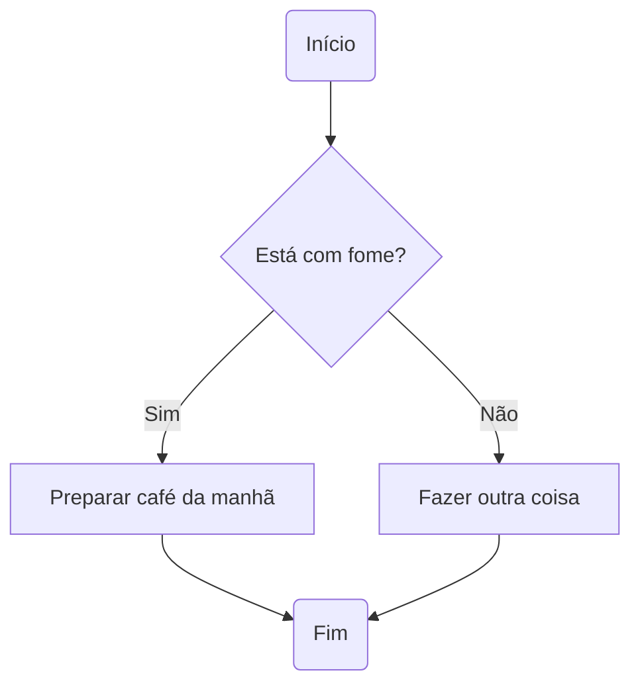

# Aula 04: Fluxogramas

Bem-vindo à quarta aula do nosso curso de lógica de programação! Hoje vamos mergulhar em um assunto super importante: **fluxogramas**. Eles são como mapas que mostram o caminho que o nosso programa vai seguir. Se você já se perdeu tentando entender como um código funciona, um fluxograma pode ser seu melhor amigo!

## O que é um Fluxograma?

Um fluxograma é uma representação visual dos passos que um programa executa. Ele usa símbolos para mostrar decisões, ações e o fluxo de informações. Com fluxogramas, fica muito mais fácil planejar e entender programas antes mesmo de começar a escrever código!

## Por que usar Fluxogramas?

- **Organização:** Ajuda a visualizar o que precisa ser feito.
- **Facilidade:** Torna mais simples explicar ideias para outras pessoas.
- **Prevenção de erros:** Você pode encontrar problemas antes de começar a programar.

## Principais Partes de um Fluxograma

Vamos dividir o estudo dos fluxogramas em partes para facilitar o entendimento. Cada parte terá uma pasta própria com exemplos em Mermaid para você visualizar.

### 01-Início-e-Fim

[Veja o README.md desta pasta para entender como marcar o começo e o fim de um fluxograma.](./01-inicio-e-fim/README.md)

### 02 - Ações e Processos

[Veja o README.md desta pasta para aprender como representar ações e processos.](./02-acoes-e-processos/README.md)

### 03 - Decisões

[Veja o README.md desta pasta para entender como mostrar decisões e caminhos diferentes.](./03-decisoes/README.md)

### 04 - Conectores e Fluxo

[Veja o README.md desta pasta para aprender como conectar partes do fluxograma e mostrar o fluxo.](./04-conectores-e-fluxo/README.md)

### 05 - Laços de repetição

[Veja o README.md desta pasta para aprender como utilizar laços de repetição e mostrar o fluxo.](./05-lacos-de-repeticao/README.md)

### 05 - Exemplos de Fluxogramas

[Confira a pasta de exemplos para visualizar fluxogramas completos e variados.](./05-exemplos-de-fluxogramas/README.md)

---

## Exemplos de Fluxogramas

Aqui está um exemplo simples usando Mermaid para mostrar como seria um fluxograma de "Tomar Café da Manhã":

---

## O que entendi?

> Escreva aqui, com suas próprias palavras, o que você aprendeu sobre fluxogramas. O que achou mais interessante? Teve alguma dúvida? Como você acha que pode usar fluxogramas para te ajudar nos estudos ou em outros projetos?
