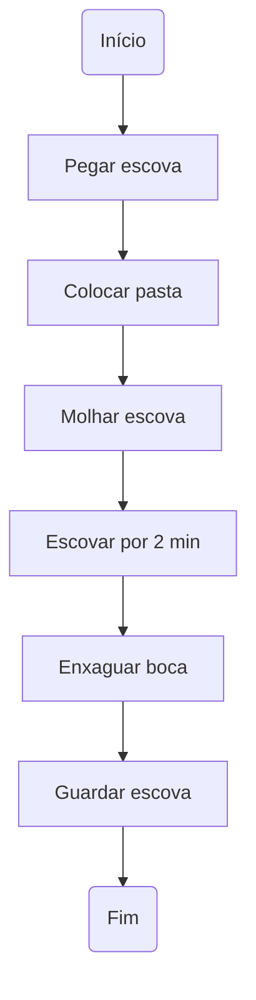

# Módulo 2: Algoritmos e Fluxogramas

Bem-vindo ao segundo módulo do nosso curso de lógica de programação! Aqui, vamos mergulhar fundo no universo dos algoritmos e fluxogramas. Prepare-se para entender como pensar como um programador e transformar ideias em passos claros e organizados.

---

## O que é um Algoritmo?

Um **algoritmo** nada mais é do que uma sequência de passos para resolver um problema ou realizar uma tarefa. Pense em uma receita de bolo: ela te diz exatamente o que fazer, em qual ordem, para chegar ao resultado final. Em programação, é a mesma coisa!

### Exemplo simples de algoritmo

Vamos criar um algoritmo para escovar os dentes:

1. Pegar a escova de dentes.
2. Colocar pasta de dente na escova.
3. Molhar a escova.
4. Escovar os dentes por 2 minutos.
5. Enxaguar a boca.
6. Guardar a escova.

Simples, né? Mas imagine se você esquecesse de molhar a escova ou de colocar a pasta... O resultado não seria o mesmo!

---

## Por que precisamos de algoritmos?

- **Organização:** Ajuda a dividir problemas grandes em partes menores.
- **Repetibilidade:** Permite repetir processos sem esquecer nenhum passo.
- **Comunicação:** Facilita explicar para outras pessoas (ou para o computador) como resolver um problema.

---

## O que é um Fluxograma?

Um **fluxograma** é uma representação visual de um algoritmo. Ele usa símbolos para mostrar cada passo e as decisões que precisam ser tomadas. É como um mapa que mostra o caminho a seguir.

### Principais símbolos de um fluxograma

| Símbolo         | Significado         |
|-----------------|--------------------|
| ⬛ Retângulo    | Ação ou processo   |
| ◯ Elipse        | Início ou fim      |
| ◇ Losango       | Decisão (Sim/Não)  |
| → Seta          | Direção do fluxo   |

---

## Exemplo de Fluxograma

Vamos transformar o algoritmo de escovar os dentes em um fluxograma:

---

## Como criar um algoritmo eficiente?

- **Seja claro:** Cada passo deve ser fácil de entender.
- **Seja lógico:** Os passos devem estar na ordem certa.
- **Evite repetições desnecessárias:** Só repita o que for realmente necessário.

---

## Pratique

1. Crie um algoritmo para preparar um miojo.
2. Desenhe o fluxograma desse algoritmo.
3. Compartilhe com um colega e veja se ele consegue seguir seus passos sem dúvidas.

---

## Explorando mais

Se quiser se aprofundar em fluxogramas, confira a pasta [`fluxogramas/`](./fluxogramas/README.md) para exemplos mais avançados e exercícios práticos.

---

## O que entendi?

> Escreva aqui, com suas próprias palavras, o que você entendeu sobre algoritmos e fluxogramas. Use exemplos do seu dia a dia para ajudar a fixar o conteúdo!

---

Continue praticando! Quanto mais você criar algoritmos e fluxogramas, mais fácil vai ficar pensar como um programador.

---

|   | Navegação |   |
|:-:|:----------|:-:|
| [⬅️ Módulo Anterior](../modulo-01-introducao/README.md) |  | [Próximo Módulo ➡️](../modulo-03-variaveis-tipos/README.md) |
