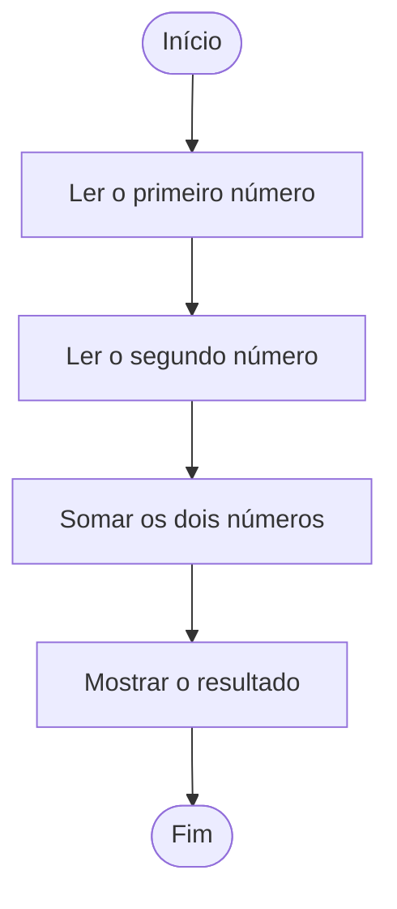

# Exemplos de Fluxogramas

Bem-vindo! Aqui vamos explorar exemplos práticos de fluxogramas, uma ferramenta essencial para entender e planejar algoritmos antes de programar. Prepare-se para visualizar ideias e resolver problemas de forma lógica e divertida!

---

## O que é um Fluxograma?

Um fluxograma é um desenho que mostra, passo a passo, como resolver um problema ou executar uma tarefa. Ele usa símbolos simples (como retângulos, losangos e setas) para representar ações, decisões e o fluxo do processo.

### Por que usar fluxogramas?

- **Visualização:** Ajuda a enxergar o caminho do algoritmo.
- **Organização:** Facilita encontrar erros e melhorar soluções.
- **Comunicação:** Torna mais fácil explicar ideias para outras pessoas.

---

## Símbolos Básicos

| Símbolo      | Nome         | Função                                 |
|--------------|--------------|----------------------------------------|
| ⬛ Retângulo | Processo     | Representa uma ação ou instrução       |
| ◇ Losango   | Decisão      | Indica uma escolha (sim/não, verdadeiro/falso) |
| ⬤ Oval      | Início/Fim   | Mostra onde o algoritmo começa/termina |
| ➡️ Seta     | Fluxo        | Indica a direção do próximo passo      |

---

## Exemplo 1: Fluxograma para Somar Dois Números

Vamos criar um fluxograma simples para somar dois números:

1. **Início**
2. Ler o primeiro número
3. Ler o segundo número
4. Somar os dois números
5. Mostrar o resultado
6. **Fim**



---

## Exemplo 2: Fluxograma para Verificar se um Número é Par ou Ímpar

1. **Início**
2. Ler um número
3. O número dividido por 2 tem resto 0?
   - Sim: Mostrar "Par"
   - Não: Mostrar "Ímpar"
4. **Fim**

```mermaid
flowchart TD
    A([Início]) --> B[Ler um número]
    B --> C{O número % 2 == 0?}
    C -- Sim --> D[Mostrar "Par"]
    C -- Não --> E[Mostrar "Ímpar"]
    D --> F([Fim])
    E --> F
```

---

## Pratique

Tente criar fluxogramas para estas situações:

- Calcular a média de três notas.
- Verificar se uma pessoa pode votar (idade >= 16).
- Mostrar todos os números de 1 a 10.

Se precisar de ajuda, peça ao seu professor ou pesquise exemplos!

---

## Explorando Mais

Se quiser se aprofundar, confira a pasta [`conceitos-fluxogramas`](../conceitos-fluxogramas/README.md) para entender mais sobre símbolos, boas práticas e dicas para criar fluxogramas incríveis.

---

## O que entendi?

> Escreva aqui, com suas próprias palavras, o que você aprendeu sobre fluxogramas. O que achou mais fácil? O que achou mais difícil? Como acha que pode usar fluxogramas no seu dia a dia?
